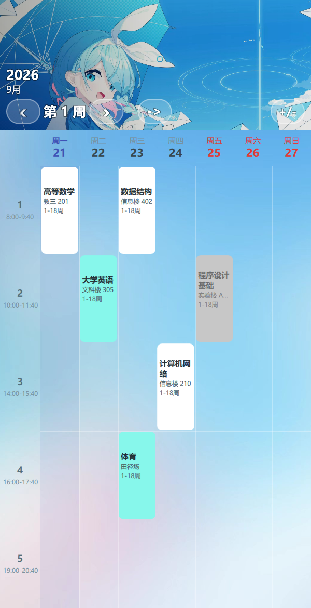

# 课程表 · CourseTable

一个 Qt 6 / QML 写的大学课程表 app。现在在桌面上跑，最终目标是打包成 Android 应用。



## 功能

- 一周 7 天 × **5 个大节**。按国内大学的习惯，一堂课分两小节，所以一节占一行，
  左侧节次列直接标出每大节的起止时间（`8:00-9:40`、`10:00-11:40` …）。
- 顶部一张横幅，年月（`2026` / `9月`）分两行压在周次导航头上，周次两边是 `‹ ›` 翻页。
- 周一到周日的日期按学期起始周自动推算，今天那列标蓝，周六周日标红。
- **法定节假日和调休补班日**从手机自带的日历里读（Android 走 JNI 读 `CalendarContract`），
  读不到的日期用内置兜底表。放假日的课整块变灰。
- 「改课」模式：点右上角 `+/-` 打开，然后点空格子加课、点已有的课改课。
- 「导课」按钮（周次行末尾的 `->`）挑一个课表 PDF。
  **目前选完只弹个回执，解析还没接**——见下面「还没做的」。

## 编译

依赖 Qt 6.5+（开发时用的是 **6.11.2 mingw_64**）、CMake 3.21+、Ninja、MinGW 13。

```bash
cmake -S . -B build -G Ninja \
  -DCMAKE_PREFIX_PATH="<Qt>/6.11.2/mingw_64" \
  -DCMAKE_MAKE_PROGRAM="<Qt>/Tools/Ninja/ninja.exe" \
  -DCMAKE_C_COMPILER="<Qt>/Tools/mingw1310_64/bin/gcc.exe" \
  -DCMAKE_CXX_COMPILER="<Qt>/Tools/mingw1310_64/bin/g++.exe"

cmake --build build

# 拷 Qt 运行库
<Qt>/6.11.2/mingw_64/bin/windeployqt.exe --qmldir qml build/CourseTable.exe
```

**`windeployqt` 这步别省。** 新加一个 QML 模块（`QtQuick.Dialogs`、`QtCore` 之类）的时候，
CMake 那边配好了、编译一路绿灯，但 `build/` 里缺 DLL 和 QML 模块，**运行到那一步才炸**。
每次动了 `import` 就重跑一遍。

## 目录

```
CourseTable/
├─ main.cpp              入口；还带一套调界面用的「截图后门」（见下）
├─ CMakeLists.txt
├─ src/
│  ├─ coursemodel.*      课程数据：QAbstractListModel + JSON 持久化
│  └─ calendardata.*     学期起始周、节假日、日期换算
├─ qml/
│  ├─ Main.qml           顶栏（横幅 / 周次 / 年月 / 导课 / 改课开关）
│  ├─ CourseGrid.qml     课表网格 + 左侧节次列 + 星期表头
│  ├─ CourseCard.qml     一格课程卡片
│  └─ CourseEditor.qml   加课 / 改课弹窗
├─ assets/               横幅和表格底图（编进 qrc，`-no-compress` 原样存）
├─ android/              Android 打包模板
│  ├─ AndroidManifest.xml
│  └─ src/com/pony/coursetable/HolidayReader.java   读系统日历里的节假日
├─ tools/                Python 辅助脚本
└─ shots/                界面截图
```

## 调界面用的截图后门

`main.cpp` 里留了几个环境变量，不用手点就能把某个状态渲染成 PNG 然后退出：

```bash
COURSETABLE_SHOT=out.png              # 输出路径，设了就进截图模式
COURSETABLE_SHOT_EDIT=1               # 先切到「改课」模式
COURSETABLE_SHOT_DIALOG=1             # 先打开「加课」弹窗
COURSETABLE_SHOT_ACTION=importDialog  # 按 objectName 找控件、调它的 open()
COURSETABLE_SHOT_DELAY=9000           # 抓图前等多久（毫秒），默认 2400
```

`tools/` 下三个脚本：

- `screenshot.py` —— 批量生成 `shots/a-normal.png`（普通）、`b-edit.png`（改课）、
  `c-dialog.png`（加课弹窗）。
- `shot_dialog.py` —— 单独抓「导课」的文件选择对话框。它是**独立顶层窗口**，
  `QQuickWindow::grabWindow()` 只抓得到主窗口，所以要 `EnumWindows` 找到它的 HWND、
  取真实可见边框（用 `DwmGetWindowAttribute(DWMWA_EXTENDED_FRAME_BOUNDS)`，
  别用 `GetWindowRect`，那个把透明阴影也算进去了），再从外面按屏幕坐标抓。
- `pick_color.py` —— 纯 Python（不依赖 Pillow）从 PNG 里取某个像素的颜色。

## 还没做的

- **PDF 课表解析**。要装 Qt PDF 模块，再照着具体课表的版式写解析；
  解析出来的周次还应该回头把「学期起始周」也定下来，现在那个值是拿今天当第一周兜底的。
- **Android 打包**。`android/` 下的清单和 Java 源码是手写的，但 JDK / SDK / NDK 还没配，
  还没出过 APK。读系统日历那段也只在 Windows 上跑过路径，真机没验证。
- Material 换肤、深色模式都没做。
